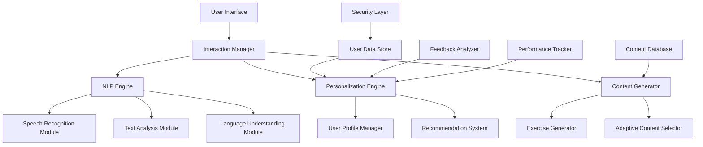

# AI-Driven HCI System Design: Personalized Language Learning Assistant

## 1. Domain and Problem Identification

**Domain:** Education (Language Learning)
**Problem:** Inefficient and non-personalized language learning experiences

Many language learning platforms offer a one-size-fits-all approach, failing to adapt to individual learning styles, paces, and specific needs. This results in suboptimal learning outcomes, decreased motivation, and higher dropout rates. Traditional methods often lack real-time feedback, interactive elements, and the ability to target specific areas of difficulty for each learner. Moreover, they may not account for the diverse backgrounds, goals, and learning preferences of users, leading to frustration and disengagement.

An AI-driven system can significantly enhance the user experience by providing personalized learning paths, real-time feedback, and adaptive content delivery. By leveraging machine learning algorithms and natural language processing, such a system can analyze user performance, identify areas for improvement, and tailor the learning experience accordingly. This personalized approach not only improves efficiency but also boosts user engagement and long-term retention of language skills.

## 2. AI/ML Algorithms and Models

Our system will leverage several AI/ML techniques to create a comprehensive and personalized language learning experience:

1. **Natural Language Processing (NLP):**
   - Speech Recognition: To analyze learner pronunciation and fluency. This involves using deep learning models trained on diverse accents and speaking styles to accurately transcribe and evaluate spoken language.
   - Text Analysis: To evaluate written responses and generate appropriate exercises. This includes grammatical error detection, sentiment analysis, and contextual understanding of written content.
   - Language Understanding: To interpret user queries and provide context-aware responses. This enables the system to engage in meaningful dialogue, answer questions, and offer explanations tailored to the user's current learning context.

2. **Machine Learning (ML):**
   - Collaborative Filtering: To recommend learning content based on similar user patterns. This technique analyzes behavior patterns across users to suggest relevant exercises, lessons, or resources.
   - Decision Trees: To create adaptive learning paths. These algorithms help in making sequential decisions about the most appropriate next steps in a user's learning journey.
   - Gradient Boosting Models: To predict user performance and identify potential areas of difficulty, allowing for preemptive support and targeted practice.

3. **Deep Learning:**
   - Recurrent Neural Networks (RNNs): For sequence prediction in language generation tasks. This is particularly useful for generating contextually appropriate responses and predicting likely user inputs.
   - Convolutional Neural Networks (CNNs): For image recognition in visual vocabulary exercises. This allows the system to understand and generate image-based content, enhancing the multimodal learning experience.
   - Transformer Models: To understand and generate human-like text, enabling more natural interactions and sophisticated language exercises.

These algorithms contribute to improving the user interface and interaction experience by:
- Providing real-time, accurate feedback on pronunciation and grammar
- Generating personalized learning content and exercises tailored to individual needs and learning styles
- Adapting the difficulty and pace of lessons based on user performance and learning curve
- Offering context-aware assistance and explanations that align with the user's current understanding and progress
- Creating a dynamic and engaging learning environment that evolves with the user's growing language proficiency

## 3. System Architecture

**Components:**
- User Interface: The front-end application where users interact with the system, designed for intuitive navigation and multi-modal input (text, speech, image).
- Interaction Manager: Coordinates communication between different system components, ensuring smooth data flow and real-time responsiveness.
- NLP Engine: Processes and analyzes user input (speech and text), comprising specialized modules for different language tasks.
- Personalization Engine: Manages user profiles and generates recommendations, continuously updating based on user interactions and progress.
- Content Generator: Creates and selects appropriate learning materials, including AI-generated exercises and curated content.
- User Data Store: Securely stores user information and learning progress, with robust encryption and privacy measures.
- Content Database: Repository of language learning resources, including text, audio, and visual materials.
- Feedback Analyzer: Processes explicit and implicit user feedback to inform system improvements.
- Performance Tracker: Monitors and analyzes user performance metrics to guide personalization.
- Security Layer: Ensures data protection and user privacy across all system components.

## 4. User Interaction Model

Users will engage with the system through a multi-modal interface that supports text, speech, and visual interactions. The interaction flow will typically follow these steps:

1. User logs in and is presented with a personalized dashboard showcasing progress, recommended activities, and personalized goals.
2. System suggests learning activities based on the user's profile, goals, and current proficiency level.
3. User engages in various exercises (speaking, listening, reading, writing) designed to target specific language skills.
4. System provides real-time feedback and adjusts difficulty as needed, ensuring a balance between challenge and achievability.
5. User can ask for help or clarification at any point, with the system offering context-aware explanations.
6. After completing activities, the system updates the user's profile and suggests next steps, including review sessions for areas needing reinforcement.

Feedback mechanisms:
- Explicit feedback: Users can rate exercises, report issues, or request different types of content. This direct input helps fine-tune the user experience.
- Implicit feedback: The system analyzes user performance, time spent on exercises, and interaction patterns to infer preferences and areas of difficulty.
- A/B testing: Regularly test new features and content delivery methods to optimize user experience. This involves presenting variations to different user groups and analyzing the outcomes.
- Continuous learning: The system uses reinforcement learning techniques to continuously improve its recommendations and content generation based on aggregate user interactions.

## 5. Handling User Errors and Misunderstandings

The system will employ several strategies to handle user errors and misunderstandings:

1. Graceful error handling: Provide clear, constructive feedback for incorrect responses, highlighting the specific area of mistake without discouraging the user.
2. Multi-attempt approach: Allow users multiple tries before providing the correct answer, with each attempt offering more targeted hints.
3. Contextual hints: Offer progressively more detailed hints to guide users towards the correct solution, drawing from the user's previous successful interactions.
4. Alternative explanations: If a user consistently struggles with a concept, provide different explanations or examples, using varied learning modalities (text, audio, visual) to cater to different learning styles.
5. Adaptive difficulty: Temporarily reduce difficulty if a user is consistently making errors, ensuring a balance between challenge and confidence-building.
6. Natural language clarification: Use the NLP engine to understand and respond to user questions about errors or misunderstandings, providing conversational support.
7. Misconception identification: Analyze patterns in user errors to identify and address common misconceptions in language learning.

## 6. Evaluation Metrics

To evaluate the success of our system in improving user experience, we will use the following metrics:

1. Usability:
   - System Usability Scale (SUS) score: A standardized measure of perceived usability.
   - Task completion rate: Percentage of learning tasks successfully completed.
   - Time-on-task efficiency: Measuring the time taken to complete specific learning activities.
   - Error rate: Frequency and type of errors made during interactions.
   - User interface interaction analysis: Heat maps and click patterns to optimize layout and navigation.

2. Effectiveness:
   - Learning outcome assessments: Pre- and post-tests to measure skill improvement.
   - Skill acquisition rate: Speed at which users master new language concepts.
   - Long-term retention rates: Periodic assessments to evaluate knowledge retention over time.
   - Progress towards individual learning goals: Tracking achievement of user-defined objectives.
   - Comparative analysis: Performance comparison with traditional learning methods.

3. Satisfaction:
   - Net Promoter Score (NPS): Likelihood of users recommending the system to others.
   - User engagement metrics: Daily active users, session length, frequency of use.
   - Qualitative feedback: Through surveys, interviews, and in-app feedback mechanisms.
   - Retention rate: Percentage of users continuing to use the system over time.
   - Emotional response analysis: Using sentiment analysis on user comments and interactions.

4. Personalization Effectiveness:
   - Recommendation acceptance rate: Frequency of users engaging with suggested content.
   - Adaptive content suitability: User-reported satisfaction and performance-based assessment of personalized content.
   - Learning path diversity: Analyzing the variety of paths users take to achieve similar goals.
   - Personalization impact: Comparing learning outcomes between users with more vs. less personalized experiences.

## 7. Challenges and Ethical Considerations

Potential challenges in implementing this AI-driven HCI system include:

1. Data collection and privacy: Balancing the need for user data to personalize the experience with privacy concerns. This involves implementing robust data protection measures and being transparent about data usage.

2. Algorithm bias: Ensuring the AI models do not perpetuate or amplify biases in language learning materials or user assessments. Regular audits and diverse training data are crucial.

3. Scalability: Managing computational resources as the user base grows and more languages are added. This may require cloud-based solutions and efficient algorithm optimization.

4. Content generation: Ensuring AI-generated content is accurate, appropriate, and beneficial for learning. This involves implementing strict quality control measures and possibly human oversight.

5. User trust: Building and maintaining user trust in AI-driven recommendations and assessments. Clear communication about the AI's role and limitations is essential.

6. Multilingual challenges: Adapting the system to work effectively across multiple languages with varying structures and cultural nuances.

7. Accessibility: Ensuring the system is usable by people with various disabilities, which may require specialized interfaces and adaptive technologies.

Ethical considerations:

1. Privacy: Implement strict data protection measures and provide clear, easily understandable privacy policies. Give users control over their data and the option to delete it.

2. Transparency: Clearly communicate to users when they are interacting with AI-generated content or receiving AI-driven recommendations. Provide insights into how personalization decisions are made.

3. Fairness: Regularly audit the system for biases and ensure equal learning opportunities for all users, regardless of their background or characteristics.

4. Accountability: Establish clear processes for handling disputes or issues arising from AI-driven decisions. Have human oversight for critical decisions affecting user progress.

5. Cultural sensitivity: Ensure the system respects and accommodates cultural differences in language use and learning styles. Involve diverse teams in the development and testing process.

6. Accessibility: Design the system to be usable by people with various disabilities, ensuring inclusive language learning opportunities. This includes considerations for visual, auditory, and motor impairments.

7. Responsible AI development: Adhere to ethical AI principles throughout the development process, including considerations of long-term societal impact.

8. Data sovereignty: Respect international data regulations and user rights, particularly when operating across different countries and jurisdictions.

By addressing these challenges and ethical considerations, we can create an AI-driven HCI system that not only enhances the language learning experience but also respects user rights, promotes equitable access to education, and contributes positively to society's technological advancement.

